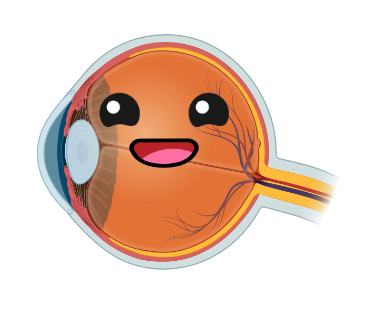

PyPlr
=====

  

*PyPlr* is a Python library for researching the pupillary light reflex with the [Pupil Core](https://pupil-labs.com/products/core/ "Pupil Core eye tracking platform") eye tracking platform. Features include:

- User-friendly and feature-rich interfaces to Pupil Core (Pupil Labs GmbH, Berlin, Germany), Spectra Tune Lab (STLAB: LEDMOTIVE Technologies, LLC, Barcelona, Spain) light engine and Ocean Optics (Ocean Insight Inc., Oxford, UK) spectrometers
- Flexible support for alternative stimulus delivery and measurement systems
- Scripting tools to facilitate stimulus design, optimisation and delivery, communication with respect to timing, and extraction, cleaning, and analysis of pupil data

The code is here: https://github.com/PyPlr/cvd_pupillometry

The documentation is here: https://pyplr.github.io/cvd_pupillometry/index.html
